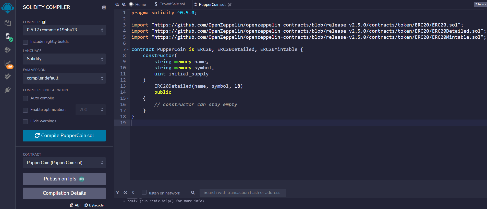
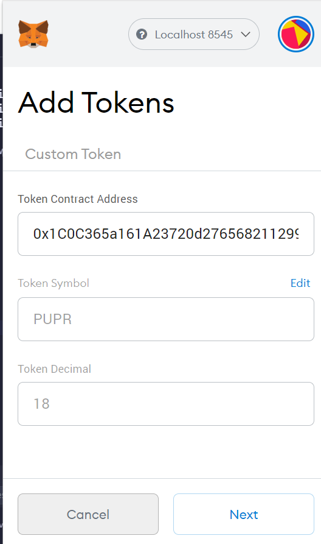

# Solidity smart contract for decentralized fund-raising through crowd sale
This repo houses solidity smart contracts to raise project development fund through crowd sale.   
Crowd-sale participants will receive PUPR coin in exchange of Ethereum on 1:1 conversation rate
    

## Smart Contract Files

* [`Puppercoin.sol`](PupperCoin.sol) -- This contract will create the token PUPR that the project aims to launch. This contract uses standard ERC20Mintable and ERC20Detailed contracts.

* [`CrowdSale.sol`](CrowdSale.sol) -- This contract implements core logic for crowdsale by using the following following OpenZeppelin contracts:  
Crowdsale  
MintedCrowdsale  
CappedCrowdsale  
TimedCrowdsale  
RefundablePostDeliveryCrowdsale  

## Dependencies
Following technical components are needed to run these contracts:
* Remix IDE for contract build, compile, deploy and transact
* Local installation of Ganache - provides dev blockchain env and 
* MetaMask (localhost:8545) wallet - source of gas fees and funds for contract deployment and transactions

## Instructions
* Clone the repo in your local directory $ git clone https://github.com/Roy-Tapas/solidity-crowdsale

1) Compile PupperCoin.SOL
   

2) Deploy PupperCoin contract
   

3) Pupper coin (PUPR) created
   

4) Compile CrowdSale.SOL
   

5) Deploy PupperCoinSaleDeployer contract
   

6) Deploy PupperCoinSale contract
   
